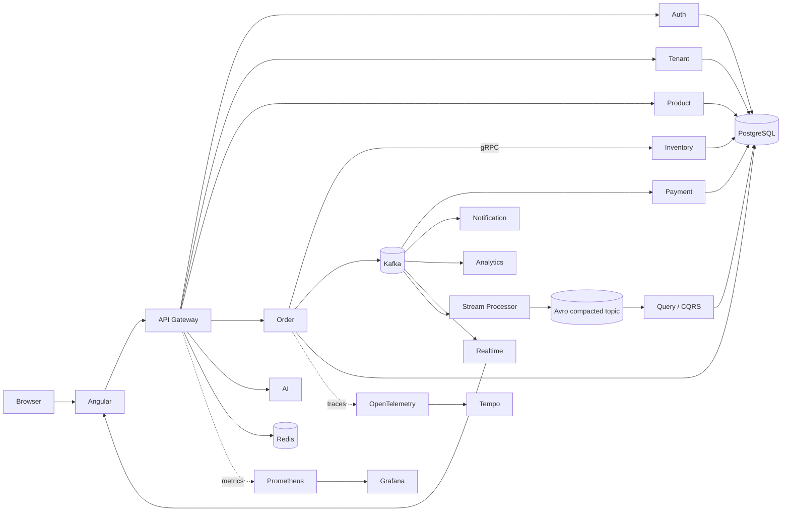
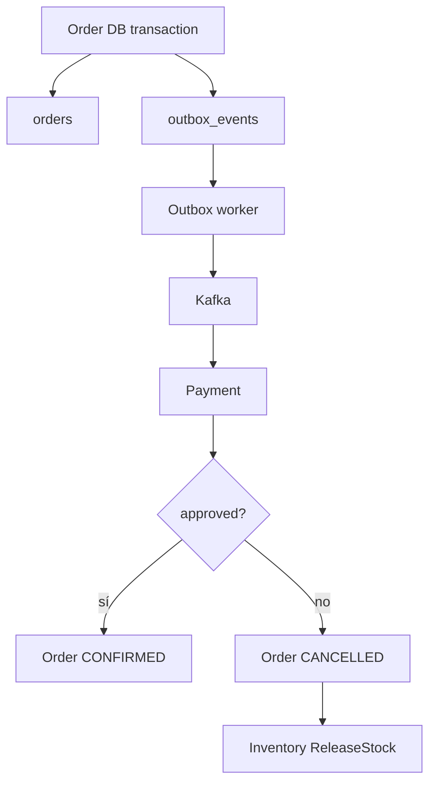
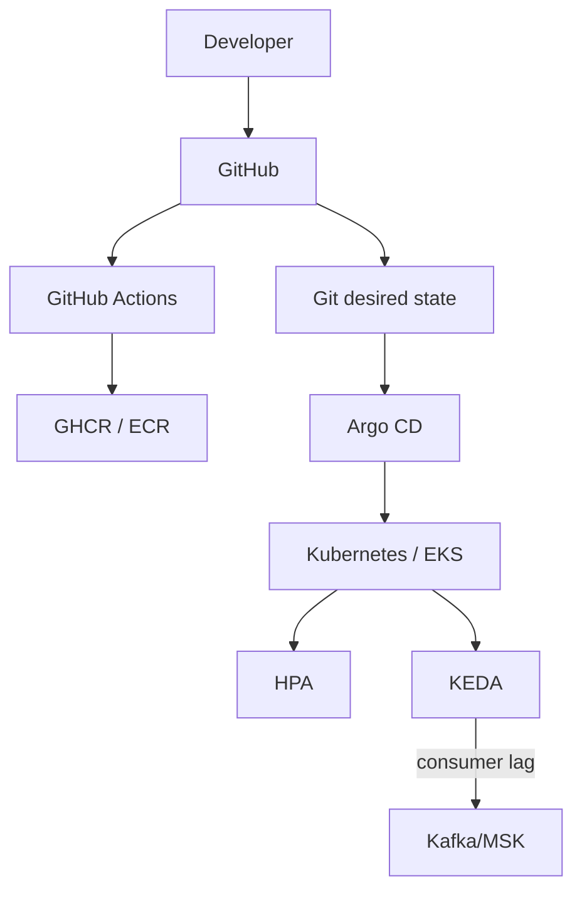

# OrderFlow Enterprise — Arquitectura para Portfolio

## Vista general

## Principio de comunicación

- **REST**: browser → gateway y operaciones síncronas orientadas a recursos.
- **gRPC**: interacción síncrona interna de baja latencia, por ejemplo reserva de stock.
- **Kafka**: hechos de negocio asíncronos y fan-out a múltiples consumidores.
- **WebSocket**: entrega de eventos al navegador en tiempo real.

## Consistencia distribuida

## Plataforma

## Seguridad

Defensa por capas:

1. HTTPS/TLS en el borde.
2. JWT + refresh token + RBAC.
3. Tenant membership + `X-Tenant-ID`.
4. Validación de entrada con Pydantic.
5. secretos fuera del repositorio.
6. Network Policies.
7. mTLS opcional entre workloads.
8. auditoría y trazabilidad.
9. AI Service read-only por defecto.

## Operación

- SLI/SLO y error budget.
- Alertmanager + runbooks.
- DR con RPO/RTO definidos.
- Chaos GameDays controlados.
- Performance con k6/Locust y P50/P95/P99.
