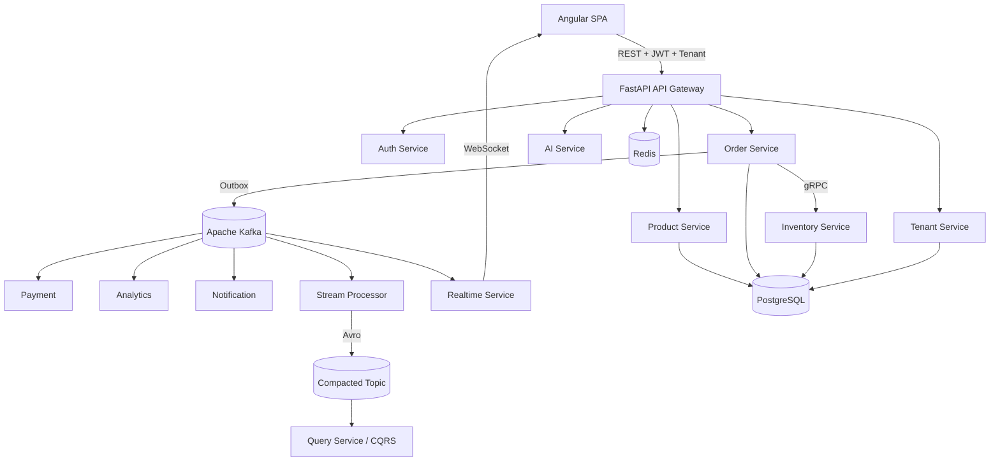
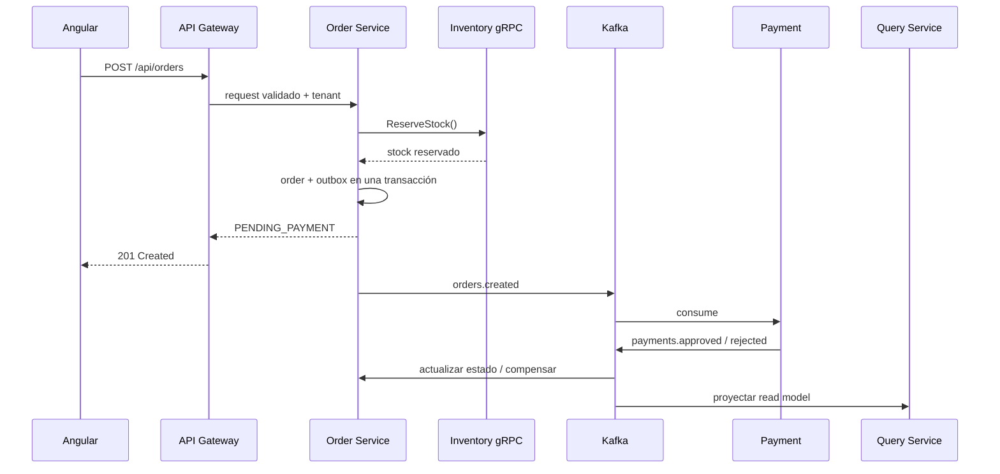

# OrderFlow Enterprise

**Plataforma SaaS empresarial distribuida** construida como proyecto integral de Backend Engineering, Event-Driven Architecture, Cloud, SRE e IA aplicada.

OrderFlow integra un frontend Angular con microservicios FastAPI, comunicación REST/gRPC, Apache Kafka, PostgreSQL, Redis, CQRS, CDC/Debezium, observabilidad, Kubernetes, GitOps, AWS, multitenancy e IA tenant-aware.

> Este repositorio está preparado tanto para **portfolio técnico** como para ejecución local mediante Docker. La versión Stage 19 no agrega otra capa de infraestructura: organiza, documenta y hace demostrable todo lo construido hasta Stage 18.

## Inicio rápido

En Windows, la forma más simple es:

```bat
INSTALL_ORDERFLOW.bat
START_ORDERFLOW.bat
```

Luego abrí:

- Aplicación: `http://localhost:4200`
- Swagger Gateway: `http://localhost:8000/docs`
- Kafka UI: `http://localhost:8088`
- Grafana: `http://localhost:3000`
- Prometheus: `http://localhost:9090`

Credencial demo:

```text
usuario: admin
clave:   Admin123!
```

> La credencial anterior es **sólo para la demo local**. No debe utilizarse en producción.

## Arquitectura en 30 segundos



## Qué demuestra el proyecto

| Área | Implementación |
|---|---|
| Frontend | Angular, guards, interceptors, RBAC, tenant selection, realtime |
| Backend | FastAPI, Pydantic, API Gateway, microservicios |
| Comunicación | REST, gRPC/Protobuf, WebSocket |
| Eventos | Kafka, topics, partitions, consumer groups, offsets |
| Consistencia | Transactional Outbox, Saga compensatoria, idempotencia |
| Resiliencia | retries, backoff+jitter, circuit breaker, bulkhead, DLQ/replay |
| Datos | PostgreSQL, database-per-service, Redis cache, pagination |
| EDA avanzada | Avro, Schema Registry, compacted topics, CQRS, Debezium CDC |
| Seguridad | JWT, refresh token, Argon2, RBAC, secrets, network policies, TLS/mTLS |
| Observabilidad | Prometheus, Grafana, OpenTelemetry, Tempo, Alertmanager |
| Plataforma | Docker, Kubernetes, HPA, KEDA, Ingress, PDB |
| Delivery | GitHub Actions, Canary, Blue/Green, Argo CD / GitOps |
| Cloud | AWS EKS, RDS, MSK, ElastiCache, ECR, Route 53, Secrets Manager |
| Operación | SLI/SLO, error budgets, runbooks, DR, chaos engineering |
| SaaS | tenants, memberships, branches, plans, quotas, aislamiento |
| IA | forecast, reposición, anomalías, RAG, agente read-only tenant-aware |

## Flujo de pedido



## Ejecutar la demo para una entrevista

```bat
START_DEMO.bat
```

Eso inicia OrderFlow y abre la aplicación, Swagger, Kafka UI y Grafana para mostrar el flujo completo.

El guion recomendado está en [`DEMO_SCRIPT_8_MIN.md`](DEMO_SCRIPT_8_MIN.md).

## Documentación de portfolio

- [`README_STAGE19.md`](README_STAGE19.md) — alcance de Stage 19.
- [`ARCHITECTURE_STAGE19.md`](ARCHITECTURE_STAGE19.md) — vista arquitectónica completa.
- [`RECRUITER_ONE_PAGER.md`](RECRUITER_ONE_PAGER.md) — resumen no técnico/técnico corto.
- [`INTERVIEW_DEFENSE_GUIDE.md`](INTERVIEW_DEFENSE_GUIDE.md) — cómo defender decisiones.
- [`TECHNICAL_DECISIONS.md`](TECHNICAL_DECISIONS.md) — trade-offs principales.
- [`GITHUB_PUBLISH_GUIDE.md`](GITHUB_PUBLISH_GUIDE.md) — publicación segura en GitHub.
- [`SCREENSHOTS_CHECKLIST.md`](SCREENSHOTS_CHECKLIST.md) — capturas recomendadas.
- [`SECURITY_PUBLICATION_CHECKLIST.md`](SECURITY_PUBLICATION_CHECKLIST.md) — controles previos a hacerlo público.
- [`docs/portfolio/index.html`](docs/portfolio/index.html) — presentación offline del proyecto.

## Validación

```bat
run_stage19_tests.bat
```

O:

```bash
python validate_stage19.py
pytest -q tests_stage19
```

Stage 19 mantiene la aplicación de Stage 18 y agrega controles de publicación, documentación y demo; no reemplaza las pruebas funcionales previas.

La regresión acumulada de Stage 11 a Stage 19 fue ejecutada en esta entrega: **149 tests PASS**. Ver `STAGE19_VALIDATION_REPORT.md`.

## Estado de producción

El proyecto es adecuado para **portfolio, aprendizaje, demo y base de desarrollo**. Los manifiestos de cloud/Kubernetes están preparados, pero antes de operar con clientes reales deben ejecutarse pruebas end-to-end en la infraestructura destino, revisión de seguridad, restore drills y configuración de secretos/credenciales reales.

## Licencia

No se impone una licencia open-source en este repositorio. Si se publica públicamente, elegí deliberadamente una licencia según el objetivo comercial antes de aceptar contribuciones externas.
